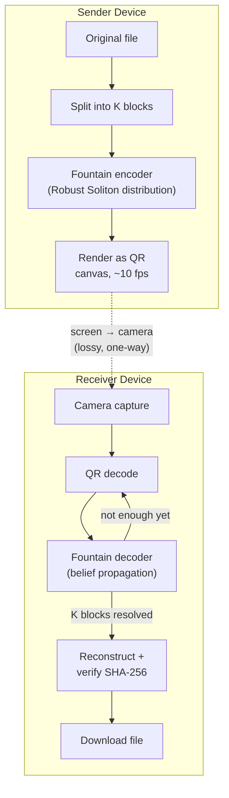

<div align="center">
  

  # OPTIX

  ### Optical Packet Transfer for Isolated eXchange

  **File transfer for devices that can't — or shouldn't — touch a network.**
  A 100% client-side web app that moves files between air-gapped devices using nothing but a screen, a camera, and an animated stream of QR codes.

  [](#license)
  [](#tech-stack)
  [](#tech-stack)
  [](#tech-stack)
  [](#the-problem)
  [](#roadmap)

  [Features](#features) · [How It Works](#how-it-works) · [Under the Hood](#under-the-hood-fountain-codes) · [Getting Started](#getting-started) · [Roadmap](#roadmap)

</div>

<br/>

## The Problem

Getting a file onto (or off of) a truly air-gapped machine — one with no Wi-Fi, no Bluetooth, no network stack enabled at all — is a genuinely hard problem. USB drives are the usual fallback, and they're also one of the best-known malware vectors on the planet (BadUSB and friends). Sometimes the network isn't just discouraged, it's physically disabled, and you still need to get a file across.

## The Solution

**OPTIX** moves files across that gap using a channel that doesn't require any networking hardware at all: a screen and a camera. The sender encodes a file into a continuous, rapidly-cycling stream of QR codes; the receiver's camera reads that stream and reconstructs the file on the other side. No pairing, no handshake, no packets ever touching a network interface — the data never leaves the optical channel.

<br/>

## Features

- **True Air-Gap** — no servers, no APIs, no Wi-Fi, no Bluetooth. The only thing that crosses the gap is light.
- **Loss-Tolerant by Design** — built on LT Fountain codes, so a missed frame is a non-event. The receiver doesn't need a specific set of frames in a specific order — just *enough* of them, however they arrive.
- **Verified, Not Assumed** — every reconstructed file is checked against a SHA-256 hash computed before the transfer began. If it doesn't match bit-for-bit, OPTIX tells you — it never hands you a file it isn't sure about.
- **Fast to Get Running** — a Vite + React app with canvas-based rendering; `npm install && npm run dev` and you're scanning within a minute.
- **Fully Static** — ships as static files. Host it anywhere, for free, forever.

<br/>

## How It Works



1. **Send.** Pick a file. OPTIX splits it into blocks, fountain-encodes them into an endless stream of packets, and cycles through them as QR frames on screen.
2. **Receive.** Point a second device's camera at the first screen. OPTIX decodes whatever frames it manages to catch and feeds them into the fountain decoder — dropped frames just mean it needs to catch a few more, not that anything failed.
3. **Verify.** Once enough packets have arrived to resolve every block, the file is reassembled and checked against its SHA-256 hash before you're allowed to download it.

<br/>

## Under the Hood: Fountain Codes

Ordinary file transfer protocols rely on two-way communication — if a packet goes missing, the receiver asks for it again (TCP's ACK/retransmit dance). An optical, screen-to-camera channel doesn't have that luxury: it's strictly one-way (simplex), and frames *will* be missed to camera blur, glare, or timing mismatches between the render and capture rates.

**LT (Luby Transform) codes** — the first practical rateless erasure code — solve this differently: instead of transmitting a fixed set of chunks, the sender generates a virtually endless stream of encoded packets. The receiver just keeps collecting until it has enough, regardless of which specific packets it caught.

**1. Packet generation.** Given source blocks $s_1, \dots, s_K$, each packet $p_n$ is built by:
- Sampling a degree $d_n$ from a probability distribution $P(d)$, $1 \le d_n \le K$
- Choosing $d_n$ distinct source blocks uniformly at random
- XOR-ing them together: $p_n = \bigoplus_{i=1}^{d_n} s_{k_i}$

**2. The Robust Soliton distribution.** The degree distribution is what makes this work. Too-low degrees and some blocks never get referenced; too-high degrees and the decoder never finds the degree-1 packets it needs to get started. OPTIX uses the **Robust Soliton distribution** $\mu(d)$ — the Ideal Soliton distribution $\rho(d)$ plus a ripple term $\tau(d)$ that keeps decoding from stalling:

$$\rho(1) = \frac{1}{K}, \qquad \rho(d) = \frac{1}{d(d-1)} \ \text{ for } d = 2, \dots, K$$

$$R = c \ln\!\left(\frac{K}{\delta}\right)\sqrt{K}$$

$$
\tau(d) =
\begin{cases}
\dfrac{R}{dK} & d = 1, \dots, \dfrac{K}{R} - 1 \\[6pt]
\dfrac{R \ln(R/\delta)}{K} & d = \dfrac{K}{R} \\[6pt]
0 & d > \dfrac{K}{R}
\end{cases}
\qquad\qquad
\mu(d) = \frac{\rho(d) + \tau(d)}{\beta}, \quad \beta = \sum_{d=1}^{K}\big(\rho(d)+\tau(d)\big)
$$

**3. Decoding (belief propagation).** For every captured packet, decoding proceeds as an "avalanche":
1. Find a packet at degree 1 — it *is* one of the original source blocks.
2. XOR that block out of every other buffered packet that referenced it.
3. Any packet that drops to degree 1 joins the front of the queue. Repeat until all $K$ blocks are resolved.

With this distribution, OPTIX needs only $K + \mathcal{O}\!\left(\sqrt{K}\ln^2(K/\delta)\right)$ packets to fully reconstruct the file — a small, well-understood overhead above the theoretical minimum.

<br/>

## Tech Stack

| Layer | Choice |
|---|---|
| Framework | React 18 + Vite |
| Language | TypeScript |
| Styling | Custom CSS, no framework dependency |
| QR engine | `jsQR` (decode) + custom canvas renderer (encode) |
| Fountain coding | Custom LT-code implementation (Robust Soliton distribution) |
| Integrity check | Web Crypto API — `crypto.subtle.digest('SHA-256', ...)` |
| Hosting | Fully static — Netlify, Vercel, GitHub Pages, or anywhere that serves files |

<br/>

## Getting Started

### Prerequisites
- [Node.js](https://nodejs.org/) v16+
- npm or yarn

### Installation

```bash
# Clone the repository
git clone https://github.com/yourusername/optix.git
cd optix

# Install dependencies
npm install

# Start the development server
npm run dev
```

The app runs at `http://localhost:5173/`.

> **Note:** Camera access requires the app to be served over `https://` or `localhost` — this is a browser security requirement, not an OPTIX limitation.

### Deployment

OPTIX is fully static and client-side, so it costs nothing to host:

```bash
npm run build
```

Deploy the resulting `dist/` folder to Netlify, Vercel, or any static host. A `public/_redirects` file is included so client-side routing survives a page refresh.

<br/>

## Roadmap

Ideas under active consideration — tracked here so scope stays honest about what's shipped versus what's planned:

- [ ] **Optional payload encryption** — password-derived key applied before fountain-encoding, as extra protection against a hostile camera recording the QR stream.
- [ ] **Client-side compression** — gzip/deflate before chunking. Meaningful win for text/JSON/uncompressed documents; near-zero benefit for already-compressed media.
- [ ] **Multi-file transfer** — client-side archive of multiple files before encoding.
- [ ] **JAB Code (ISO/IEC 23634) high-density mode** — an opt-in color-barcode mode for higher throughput. Flagged as experimental: screen-to-camera color fidelity is a materially harder problem than QR's binary contrast, and the JS ecosystem for it is still immature. Won't become the default until it's been proven reliable across real devices and lighting conditions.
- [ ] **Auto-tuned frame rate & error correction** — adapt `frame_interval_ms` and QR ECC level based on observed scan performance rather than fixed defaults.

<br/>

## Contributing

Issues and pull requests are welcome. If you're proposing a protocol-level change (packet format, fountain-code parameters), please include the reasoning — this project treats correctness of the encode/decode round-trip as non-negotiable, so changes there get read carefully.

<br/>

## License

This project is licensed under the MIT License. See [LICENSE](LICENSE) for details.

---
<div align="center">
  <sub>Built for reliable transfer in completely isolated environments.</sub>
</div>